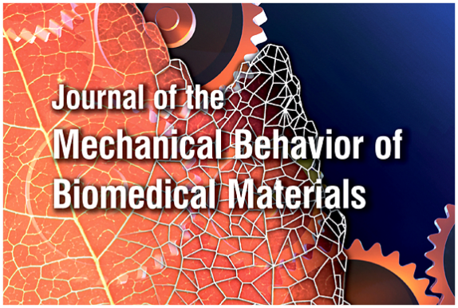

Hi, I am a Postdoctoral Associate in the Department of Mechanical Engineering at [Boston University](https://www.bu.edu/), working in the [Skeletal Mechanobiology and Biomechanics Laboratory](https://morganresearchlab.org/) with Professor [Elise F. Morgan](https://www.bu.edu/eng/profile/elise-morgan-ph-d/). Previously, I completed my Ph.D. in the Department of Civil and Systems Engineering at [Johns Hopkins University](https://www.jhu.edu/), advised by Professor [Stavros Gaitanaros](https://orbit.dtu.dk/en/persons/stavros-gaitanaros/). Before that, I earned my M.S. in Civil Engineering from [Northwestern University](https://www.northwestern.edu/) and my B.S. in Civil Engineering from [Zhejiang University](https://www.zju.edu.cn/english/).

Research Interests
======
My research focuses on the **mechanics of architected materials** bridging engineered metamaterials, human bone, and biomedical scaffolds to **advance musculoskeletal health** through **experimental**, **computational**, and **artificial intelligence methods**. At the core of my research lies: <u>leveraging mechanical principles of metamaterials to assess bone fracture risk, while simultaneously translating mechanical designs of metamaterials as scaffolds to support bone tissue regeneration</u>. Particularly, my research interests are:
- Nonlinear mechanics and failure mechanisms of metamaterials
- Machine learning-aided design of mechanically multifunctional metamaterials
- Multiscale biomechanics of bone
- Artificial intelligence-assisted clinical assessment of skeletal fragility
- Mechanics-driven design of bone regenerative scaffolds

News
======

<strong>[Oct. 2025]</strong> We are organizing a symposium on <em>Machine Learning in Biomechanics and Mechanobiology</em> at the 2026 U.S. National Committee for Theoretical and Applied Mechanics conference. <strong>Abstract submissions are welcome!</strong>

<strong>[May 2025]</strong> I am honored to serve as Chair of the newly approved U.S. Association for Computational Mechanics (USACM) Local Student Chapter at Boston University - <strong>stay tuned for our upcoming events!</strong>                                  

<strong>[Mar. 2025]</strong> Our paper <em>"A data-driven framework for developing a unified density-modulus relationship for the human lumbar vertebral body"</em> is now online in the <strong>Journal of the Mechanical Behavior of Biomedical Materials</strong>.

<strong>[Feb. 2025]</strong> Our work on <em>"A Data-Driven Framework for the Modulus–Density Relationship of the Human Lumbar Vertebral Body"</em> has been presented at the <strong>Orthopaedic Research Society 2025 Annual Meeting</strong> in Phoenix, Arizona.

