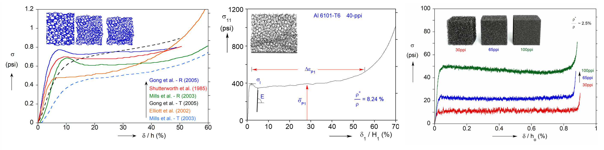

### •  Instability, plasticity, and damage in metamaterials

Despite comparable macroscopic compressive responses, metamaterials composed of different parent solids exhibit distinct failure mechanisms: elastomeric foams buckle via instability governed by microstructural anisotropy and polydispersity, metallic foams fold through yielding influenced by the plastic hardening of the parent solid, and carbon foams deform through progressive damage driven by stress concentrations at nodal joints.

### •  Fracture mechanics of metamaterials

The presence of microstructure in metamaterials redistributes the stress intensity field ahead of the crack, invalidating the centric assumption of universal near crack-tip fields. Hence, the fracture mechanics of metamaterials is investigated through a global energy-based framework, and fracture energy is shown to be a more appropriate metric of fracture resistance than the conventional fracture toughness.

### •  Shock impact dynamics of metamaterials

The dynamic performance of metamaterials is counterintuitively only minimally affected by their microstructural details and is instead governed by total mass, quasi-static strength, and the rate-dependent hardening of the parent solid. As a result, two topologies with distinct morphological characteristics but identical density and quasi-static strength exhibit similar dynamic stress level under shock impact.

