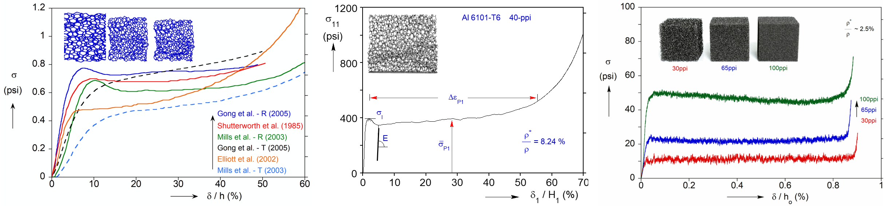

### •  Instability, plasticity, and damage in metamaterials

Despite comparable macroscopic compressive responses, metamaterials composed of different parent solids exhibit distinct failure mechanisms: elastomeric foams buckle via instability governed by microstructural anisotropy and polydispersity, metallic foams fold through yielding influenced by the plastic hardening of the parent solid, and carbon foams deform through progressive damage driven by stress concentrations at nodal joints.

### •  Fracture mechanics of metamaterials

Description of subproject 2: modeling methods, simulations, etc. Description of subproject 2: modeling methods, simulations, etc. Description of subproject 2: modeling methods, simulations, etc. Description of subproject 2: modeling methods, simulations, etc. Description of subproject 2: modeling methods, simulations, etc.

### •  Shock impact dynamics of metamaterials

Description of subproject 3: results, correlations, insights.

