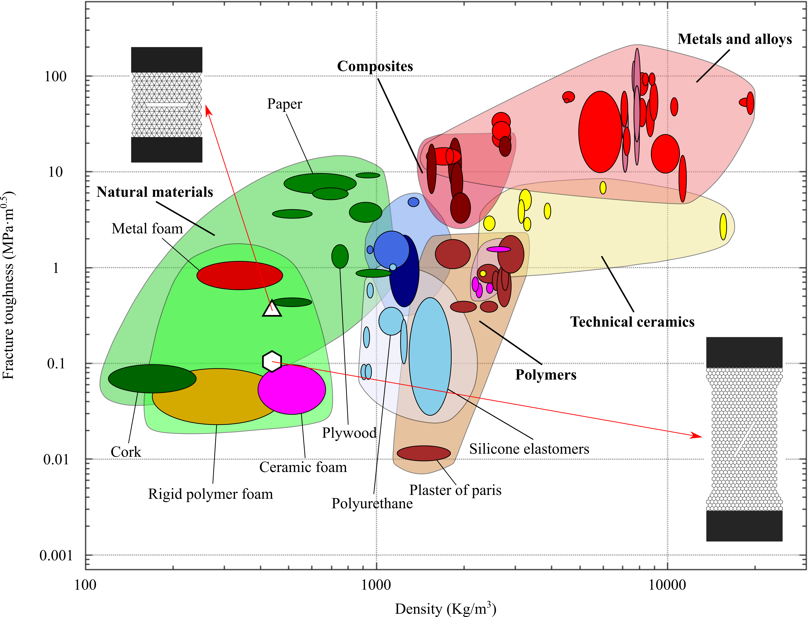

### •  Macroscopic property prediction in metamaterials

The vast number of microstructural features and their intricate interactions significantly hindered property estimation in metamaterials. Here, we generate a virtual dataset of over 8,000 ordered and disordered microstructures and develop a machine learning model for the accurate prediction of their macroscopic mechanical properties directly from their microstructures.

### •  Structure-property correlations in metamaterials

The presence of microstructure in metamaterials redistributes the stress intensity field ahead of the crack, invalidating the centric assumption of universal near crack-tip fields. Hence, the fracture mechanics of metamaterials is investigated through a global energy-based framework, and fracture energy is shown to be a more appropriate metric of fracture resistance than the conventional fracture toughness.

