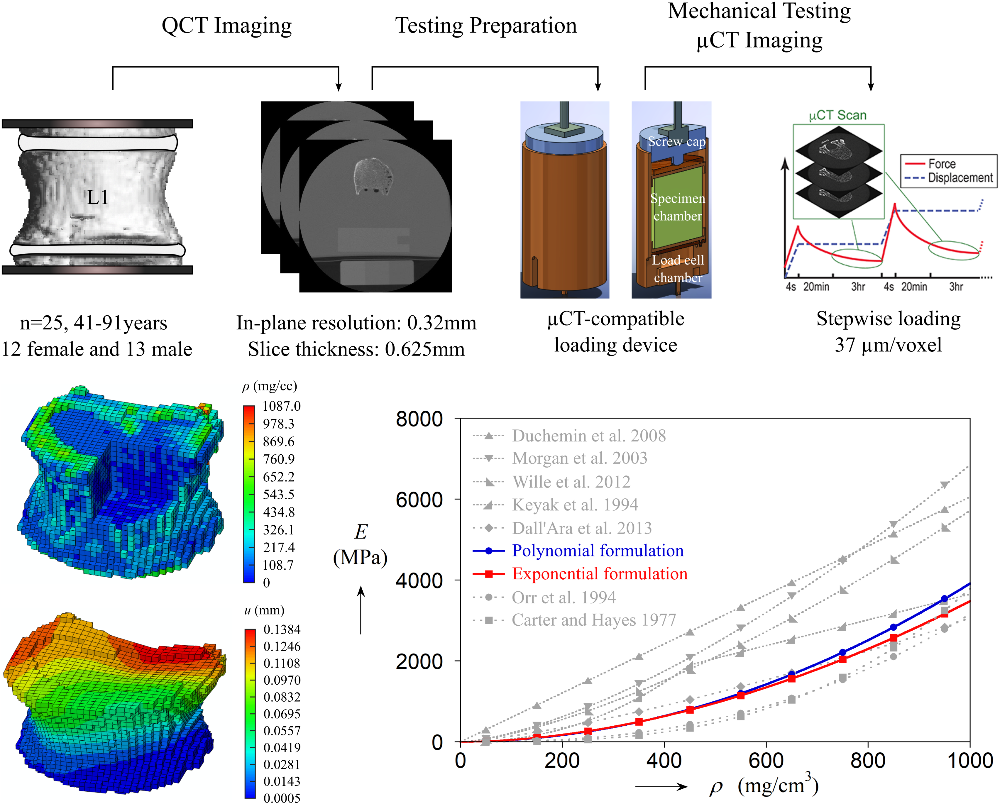

### •  Vertebral Density-Modulus Relationship

Computed tomography-based computational modeling offers a promising approach to representing bone tissue distribution; however, translating microstructure into mechanical properties has largely relied on experiments, often producing results that differ significantly and show poor agreement. Here, we develop a data-driven framework that integrates imaging, experimental testing, and numerical modeling of human lumbar vertebrae to establish a unified density–modulus relationship across the entire vertebral body.

### •  Vertebral Data-Driven Multiscale Modeling

Using interpretable machine learning algorithms, we identify a clear hierarchy of microstructural features governing mechanical properties: relative density primarily modulates the overall stiffness level; nodal connectivity or cell compactness serves as secondary factor, with extreme values pushing stiffness towards the upper or lower bounds; within the intermediate regime, strut orientation becomes the decisive factor determining the final stiffness value.

