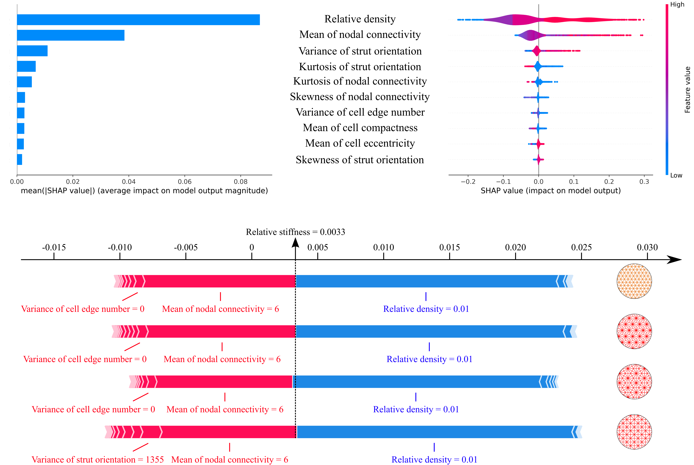

### •  Macroscopic property prediction in metamaterials

The vast number of microstructural features and their intricate interactions significantly hindered property estimation in metamaterials. Here, we generate a virtual dataset of over 8,000 ordered and disordered microstructures and develop a machine learning model for the accurate prediction of their macroscopic mechanical properties directly from their microstructures.

### •  Structure-property correlations in metamaterials

Using interpretable machine learning algorithms, we identify a clear hierarchy of microstructural features governing mechanical properties: relative density primarily modulates the overall stiffness level; nodal connectivity or cell compactness serves as secondary factor, with extreme values pushing stiffness towards the upper or lower bounds; within the intermediate regime, strut orientation becomes the decisive factor determining the final stiffness value.

