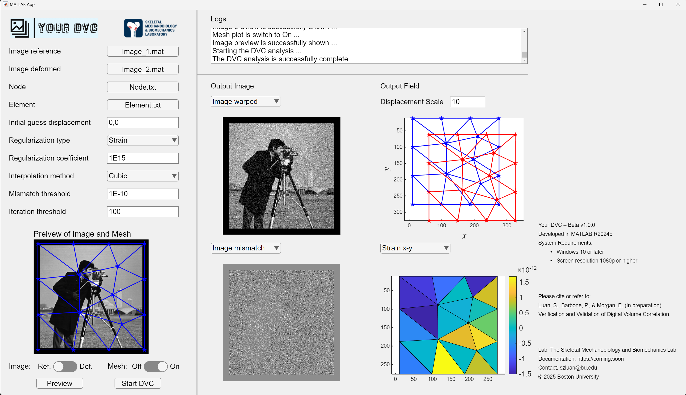

### •  Software — Your DVC

To quantify deformation from continuous experimental biomedical imaging of specimens, we developed a digital volume correlation software, Your DVC. This open-source software can measure the deformation of a series of biomedical images (more than two) of a specimen, with control over interpolation order, regularization type and coefficient, and the initial field guess, enabling accurate voxel-level displacement and strain analysis.

### •  Experimental deformation tracking via imaging

In bone biomechanics modeling, in silico models constructed from standard-resolution imaging lack adequate microstructural details and sufficient validation, whereas models built from high-resolution imaging demand excessive computational resources and prohibitively high radiation doses. Hence, we develop a data-driven multiscale modeling framework aimed at estimating human vertebral performance both accurately and efficiently, with strong potential for clinical translation.

